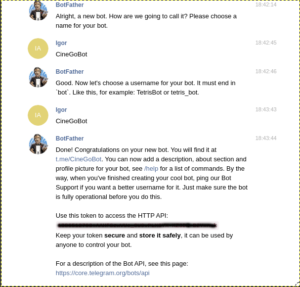

# Projeto chatbot no telegram com Java e Botfather


##  Pré-requisitos para execução do Bot
 - Tecnologias necessárias.
 
    1- Para executar o projeto é necessário ter instalado Java SE Development Kit.
 
    2- Utilizar uma IDE para execução.

 - Dados do Bot
   
      
---

## Instalação e execução do projeto


`$ git clone https://github.com/igor-fga/telegrambot.git`

No diretório `src` no pacote `br.com.fiap.main` existe um arquivo chamado `Main.java` . 
Abra esse arquivo e execute `Run`

Em seguida abra o seu [telegram](https://web.telegram.org/) e pesquise o nosso bot  `@CineGoBot`

---
##  Criando um novo bot(opcional)

 
Esse bot será o responsável por enviar notificações ao seu ambiente e para o desenvolvimento do Bot, é necessário solicitar um token para o 
[@BotFather](https://telegram.me/BotFather), um bot do próprio Telegram para criação e gestão dos Bots. 

Como todas as requisições serão feitas por uma conexão HTTP, é necessário ter uma chave de acesso privada para o seu bot, para isso, inicie uma conversa com o `BotFather` e digite `/newbot` ele irá te perguntar o nome do seu bot e gerar uma chave de acesso no final, guarde ela, usaremos mais adiante.




---
### Comunicação com a API

Para comunicação com a API criamos um objeto com o token da API HTTP do BotFather da etapa anterior. 
```
TelegramBot bot = new TelegramBot("TOKEN");
```
Para enviar notificações, simplesmente chamamos  `bot.execute(new SendMessage(update.message().chat().id(), responseMessage))`, passando a mensagem.

---

## Telegram Documentação oficial

[https://core.telegram.org/bots](https://core.telegram.org/bots)
  	
[https://core.telegram.org/bots/api](https://core.telegram.org/bots/api)
