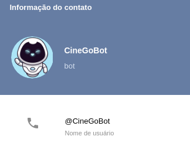

# Projeto chatbot no telegram com Java e Botfather

##  Pré-requisitos para execução do Bot
 - Tecnologias necessárias.
 
    1- Para executar o projeto é necessário ter instalado Java SE Development Kit.
 
    2- Utilizar uma IDE para execução.

 - Dados do Bot
   
   
   

## Instalação e execução do projeto

`$ git clone https://github.com/igor-fga/telegrambot.git`

No diretório `src` no pacote `br.com.fiap.main` existe um arquivo chamado `Main.java` . 
Abra esse arquivo e execute `Run`

Em seguida abra o seu [telegram](https://web.telegram.org/) e pesquise o nosso bot  `@CineGoBot`

---

